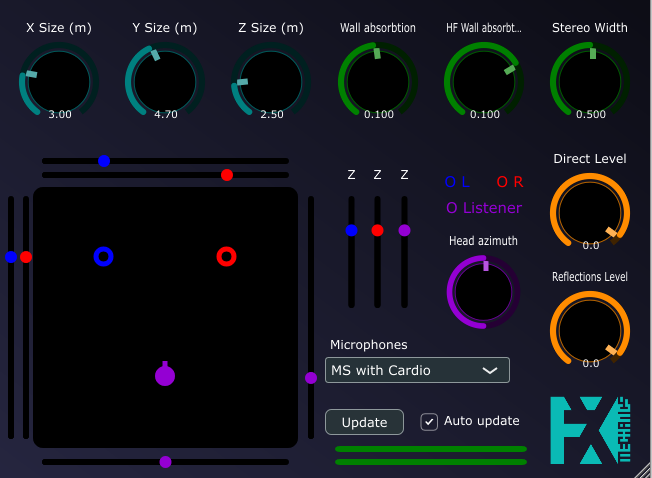
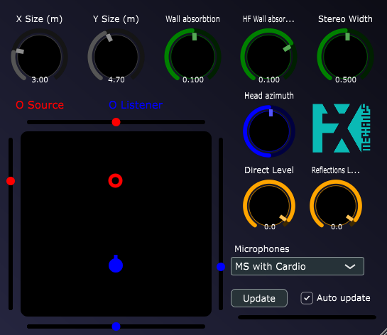

# Binaural Room Reverb (BiRR) 2D and 3D

A realistic room simulator based on a combination of a convolution processor and a virtual room impulse response calculator.

<!-- ### BiRR2D
 -->

## Info

BiRR2D and BiRR3D are room simulators that accurately emulate the sound produced by a monophonic and omnidirectionnal source perceived by a listener in a rectangular (2D) or parallelepipedic (3D) room.

User can control $(x,y,z)$ dimensions of the room, and position of source and listener in the room. The orientation of the listener can also be adjusted. Wall properties are adjusted with only two parameters:

- Wall absorbtion : a coefficient between 0 an 1, representing a reflection coefficient. The acoustic wave amplitude is multiplied by this coefficient at each wall rebound. Higher values produce a shorter reverb.

- Wall high frequency absobtion : this parameter controls the high frequency absorbtion wall rebounds. Higher values produce darker reverb sound.

The input is mono or stereo, depending on the chosen version (mono in or stereo in). The output sound is a stereo reverberberated sound with one of the following configurations:

- Two cardioid microphones in XY configuration

- One cardioid and one eight-pattern microphones, in MS configuration

- One omni and one eight-pattern microphone, in MS configuration

- Binaural receptor based on the HRTF provided by MIT medialab (https://sound.media.mit.edu/resources/KEMAR.html), and equalized to sound as neutral as possible compared to the dry original sound.

The 2D version simulates a 2D rectangular flat domain. Consequently, the produced binaural sound doesn't consider height information for sources and listener. The 3D version simmulates a parallelepipedic room, height position of the sources and listener. The latter hence involves more cpu computations for the impulse responses calculations.

## Direct path and reflections paths

when a parameter is changed, two stereo impluse responses are calculted and sent to convolution processors:

- The direct path impluse response.

- The impulse response due to multiple reflections on walls.

The effect level of direct path and reflections can be adjusted separately. These can be sought as dry and wet parameters of the reverb, although the produced sound is physically acurate when both parameters are equal.

## Stereo width

In the XY configuration, this parameter specifies the angle between the two cardioid microphones. At its minimum the angle is zero and the produced sound is mono. At its maximum value, the angle equals 180 degrees, the microphones being perpendicular to the head axis. In the standard XY configuration, the angle equals 90 degrees, which occurs when the width parameter equals 0.5.

In the MS configurations the stereo with quantifies the amplitude of the figure eight microphone signal (between 0 and 1).

The stereo width parameter has no effect in the binaural configuration.

## Parameters updating

At each parameter update (except reverb levels), the impulse response is calculated. As each acoustic path has to be calculated, the computation time can be high, in particular if the damping is small.

A number of threads equal to the number of CPUs is employed for the impulse response calculation, which allows reasonable computation times (At most a few seconds for largest reverberation times on recent CPUs).

*Important note:* the fact that some calculation time is necessary after each parameter change prevents parameter automation, as they cannot be updated in real time. Consequently, this plugin cannot be used to move sounds in the virtual space.

## History

- v0.0.1: First version

- v0.0.2: Introduction of mono and stereo input version

- v0.0.3: Fix bug that prevented direct path to be computed

- v0.0.4: Fix crash occuring when parameters are updated, binaries now distributed as VST3

## Compilation

BiRR depends on the JUCE library (visit juce.com), with additional components from fxmejucetools, provided as a JUCE module (visit https://github.com/odoare/FxmeJuceTools)

## Future improvements

In priority order:

- Ambisonic output (FOA)

- Absorption parameters for each wall

- Multiple inputs (and ability to place multiple virtual sources in the room in the same UI)

- Faster convolution (?)

- Rooms not necessarly parallelepipedic

## Contact

olivier.doare@ensta-paris.fr
